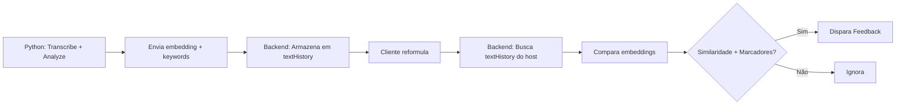

## Planejamento Arquitetural: Detecção “Solução foi compreendida” (Reformulação do Cliente)

**Objetivo**: gerar um feedback em tempo real para o vendedor quando o **cliente reformula a solução com as próprias palavras** (sinal forte de compreensão).  
**Base semântica**: “frases de reformulação pelo cliente” (teach‑back / paraphrase).  
**Fluxo**: igual ao de indecisão (áudio → Python `text_analysis_result` → `FeedbackAggregatorService` → `FeedbackDeliveryService` → overlay na extensão).

---

## Checklist (passo a passo)

> Use esta lista como roteiro de implementação. As seções abaixo já estão organizadas nos mesmos passos, com detalhes.

- [ ] **Passo 0 — Confirmar o pipeline e dados disponíveis** (payload já tem `analysis.embedding`, keywords, speech_act).
- [ ] **Passo 1 — Definir o sinal e falsos positivos** (o que é “reformulação” vs “ok entendi”).
- [ ] **Passo 2 — Escolher base semântica e thresholds iniciais** (cosine similarity + ranges).
- [x] **Passo 3 — Reutilizar textHistory existente** (sem estado adicional).
- [x] **Passo 4 — Armazenamento Automático** (sem filtro especial).
- [ ] **Passo 5 — Detectar marcadores de reformulação do cliente** (regex/substring + “conteúdo suficiente”).
- [x] **Passo 6 — Calcular similaridade e confidence combinado** (pesos atualizados).
- [ ] **Passo 7 — Gating + cooldown + antispam** (mesmo padrão do indecision).
- [ ] **Passo 8 — Definir payload/UX do feedback** (`severity`, message, tips, metadata).
- [x] **Passo 9 — Implementação no backend** (simplificada com textHistory).
- [x] **Passo 10 — Python Service** (sem mudanças necessárias).
- [ ] **Passo 11 — Testes e validação** (unit + golden dataset).
- [ ] **Passo 12 — Rollout e segurança** (feature flag, env vars, privacidade).
- [ ] **Passo 13 — Riscos e mitigação** (FPs, contexto errado, transcrição ruidosa).
- [ ] **Passo 14 — DoD** (critérios de pronto).

---

## Arquitetura Atual (Implementada)

### Fluxo Simplificado



### Responsabilidades

**Python Service:**
- Transcrição (Whisper)
- Análise de texto (BERT/SBERT)
- Extração de embeddings e keywords
- Envio via Socket.IO ou Redis

**Backend Node.js:**
- Recebe text_analysis_result
- Armazena automaticamente em textHistory
- Detecta reformulação comparando textHistory cliente vs host
- Dispara feedback

### Estado e Persistência

- ✅ `textHistory`: Mantido em memória por participante (últimos 20 chunks)
- ❌ Sem `solutionContextByMeeting` ou estado adicional
- ✅ Compatível com múltiplas instâncias backend
- ✅ Compatível com Redis architecture

---

## Passo 0 — Confirmar o pipeline e dados disponíveis

- **Python Service** realiza transcrição (Whisper) e análise (BERT/SBERT)
- Envia via Socket.IO ou Redis: `text_analysis_result` com:
  - `analysis.embedding: number[]` (SBERT, dimensão 384)
  - `analysis.keywords: string[]`
  - `analysis.speech_act`, `analysis.intent`, etc.
  - `analysis.reformulation_markers_detected` (opcional)

- **Backend (Nest)** recebe via `TextAnalysisService`
- Armazena automaticamente em `textHistory` (últimos 20 chunks por participante)
- `FeedbackAggregatorService` detecta reformulação comparando textHistory do cliente com textHistory do host

**Importante:** A implementação atual NÃO requer mudanças no serviço Python, apenas no backend.

---

## Passo 1 — Definição operacional do sinal (“cliente reformulou a solução”)

Chamaremos de **Reformulação do Cliente** um turno de fala do cliente que:

- **(A) É metacomunicativo de compreensão** (ex.: “entendi”, “se eu entendi bem”, “então é assim…”, “ou seja…”, “resumindo…”), e
- **(B) Reexpressa o mecanismo/benefício da solução** usando conteúdo (não apenas “ok entendi”), e
- **(C) Tem alta similaridade semântica** com a explicação de solução dita anteriormente pelo vendedor.

O feedback “solução foi compreendida” deve disparar quando a evidência \(A \land B \land C\) for forte o suficiente.

---

## Passo 2 — Base semântica (embeddings + cosine similarity)

“Reformulação” é, por natureza, **paráfrase**. Se o cliente compreende, ele tende a:

- manter o **mesmo significado**
- trocar **termos/sintaxe**

Embeddings semânticos capturam isso bem (ao contrário de matching literal por palavras).

Vamos usar **cosine similarity**:

\[
\text{cos\_sim}(u,v) = \frac{u\cdot v}{\|u\|\|v\|}
\]

Onde:
- \(u\) = embedding do turno do cliente (candidato)
- \(v\) = embedding de um **resumo do “contexto de solução”** recente do vendedor (centroide/mean pooling)

---

## Passo 3 — Reutilizar textHistory existente

### Arquitetura Simplificada

- **Sem estado adicional**: Backend reutiliza `textHistory` já mantido em `ParticipantState`
- `textHistory` armazena automaticamente:
  - Últimos 20 chunks de texto por participante
  - Inclui: `text`, `timestamp`, `embedding`, `keywords`, `sales_category`, etc.

### Como funciona

Ao detectar reformulação, backend:
1. Busca todos os participantes do meeting
2. Filtra hosts (`role='host'`)
3. Extrai textHistory recente (últimos 60-90s)
4. Compara embeddings do cliente com centroid do textHistory do host

### Vantagens

- ✅ Sem código adicional para manter contexto
- ✅ Sem `SolutionContextEntry` ou Map adicional
- ✅ Compatível com múltiplas instâncias backend
- ✅ Compatível com Redis architecture
- ✅ ~150 linhas de código removidas vs arquitetura anterior

---

## Passo 4 — Armazenamento Automático (Todos os Participantes)

### Simplicidade da Nova Arquitetura

- **Sem filtro especial**: Todo texto analisado é armazenado no `textHistory`
- **Sem cálculo de "strength"**: Não há heurística para detectar se um turno do host é "explicação"
- **Backend usa TODOS os chunks recentes do host** para comparação
- **Validação acontece na detecção**: Similaridade semântica + marcadores de reformulação garantem precisão

### Vantagens

- ✅ Menos código, menos estados, mais robusto
- ✅ Não precisa manter lógica de "o que é explicação"
- ✅ Validação semântica (embedding similarity) é mais precisa que heurísticas de texto
- ✅ Funciona para qualquer tipo de solução/produto (não depende de palavras-chave fixas)

### Mitigação de Falsos Positivos

O risco de "contexto errado" é mitigado por:
1. **Janela temporal curta** (60-90s): apenas chunks recentes
2. **Similaridade semântica alta** (>= 0.6): embedding do cliente deve ser similar ao do host
3. **Keyword overlap**: valida que cliente usa termos relacionados
4. **Marcadores obrigatórios**: cliente deve usar frases de reformulação explícitas

---

## Passo 5 — Heurística: como detectar “frases de reformulação” no turno do cliente

### 1) Marcadores de reformulação (lista inicial PT‑BR)

Crie um detector leve por regex/substring (sem NLP pesado):

- “se eu entendi”
- “entendi então”
- “entendi que”
- “então vocês”
- “ou seja”
- “resumindo”
- “na prática então”
- “quer dizer que”
- “basicamente”
- “só pra confirmar”
- “deixa eu ver se entendi”
- “então o que você está dizendo é”

Retornar:
- `markersDetected: string[]`
- `markerScore` (ex.: min(1, markersDetected.length / 2))

### 2) “Conteúdo suficiente” (evitar falso positivo de “ok entendi”)

Regras simples:
- texto do cliente precisa ter pelo menos `MIN_REFORMULATION_CHARS` (ex.: 30–50)
- e/ou pelo menos 1–2 keywords relevantes (interseção com keywords do contexto do host)

---

## Passo 6 — Cálculo de similaridade e confidence (Implementação Atual)

### 1) Construção do vetor de contexto do host

Busca textHistory do host no intervalo [now - 90s, now].  
Compute o centroide:

\[
v = \text{mean}(e_1, e_2, ..., e_n)
\]

Se \(n=0\), não há contexto → não disparar.

### 2) Similaridade

\[
s = \text{cos\_sim}(u, v)
\]

Valores típicos com SBERT:
- < 0.55: não relacionado
- 0.60–0.70: possivelmente relacionado (depende de ruído)
- > 0.72: fortemente relacionado (bom threshold inicial)

### 3) Confidence combinado (Nova Fórmula)

Componentes:

- `similarityScore` = clamp((s - 0.55) / 0.25, 0, 1)
- `markerScore` = clamp(markers.length / 2, 0, 1)
- `keywordOverlapScore` = clamp(overlap / 3, 0, 1) onde overlap = |KW_client ∩ KW_host|
- `speechActScore`:
  - 1.0 se `speech_act` ∈ {`agreement`, `confirmation`}
  - 0.5 se `ask_info` (pode ser confirmação)
  - 0.0 caso contrário

**Confidence final (pesos atualizados):**

```typescript
confidence =
  similarityScore * 0.50 +      // ↑ Aumentado de 0.45
  markerScore * 0.25 +          // ↑ Aumentado de 0.20
  keywordOverlapScore * 0.15 +  // = Mantido
  speechActScore * 0.10         // ↑ Aumentado de 0.05
```

**Mudanças vs arquitetura anterior:**
- ❌ **Removido:** `contextStrength` (15%) - não há mais cálculo de strength
- ✅ **Redistribuído:** pesos aumentados em similarity, markers e speechAct

**Threshold inicial:**
- `SALES_SOLUTION_UNDERSTOOD_THRESHOLD=0.70` (padrão)

---

## Passo 7 — Regras de disparo (gating) e antispam

### Gating mínimo (antes de calcular/confiança)

Só avalia o detector se:
- o falante é **cliente** (não host)
- `markersDetected.length > 0`
- texto do cliente >= `MIN_REFORMULATION_CHARS`
- existe contexto de solução do host na janela (>=1 entry)

### Cooldown

Evitar spam:
- `SALES_SOLUTION_UNDERSTOOD_COOLDOWN_MS` default 120000 (2 min)
- mesma regra de “cooldown desabilitado com 0” usada em indecisão pode ser reaproveitada.

### Dedupe semântico (opcional)

Mesmo dentro do cooldown, pode haver casos onde vale notificar “de novo” (ex.: reformulações de pontos diferentes). Para o MVP, **não** faça isso; mantenha simples.

---

## Passo 8 — Feedback gerado (payload e UX)

### Novo tipo

Adicionar `sales_solution_understood` (ou nome equivalente) como `FeedbackType`.

Recomendação:
- `severity: 'info'` (é um “bom sinal”, não alerta)

### Mensagem e dicas (curtas e acionáveis)

- **message (exemplos)**:
  - “Cliente reformulou sua solução — parece que entendeu.”
  - “Bom sinal: o cliente está ‘devolvendo’ o entendimento da solução.”

- **tips (exemplos)**:
  - “Confirme: ‘Perfeito — é isso mesmo.’”
  - “Valide o próximo passo: ‘Faz sentido avançarmos para X?’”
  - “Pergunte o critério: ‘O que falta para decidir?’”

### Metadata (para debug e evolução)

Salvar no `metadata`:
- `similarity_raw` (s)
- `confidence`
- `markers_detected`
- `keyword_overlap`
- `solution_context_excerpt` (1–2 frases do host)
- `client_reformulation_excerpt` (trecho do cliente)

---

## Passo 9 — Implementação no Backend (Arquitetura Simplificada)

### Detector: `detect-solution-understood.ts`

**Localização:** `apps/backend/src/feedback/a2e2/text-analysis/detect-solution-understood.ts`

**Método principal:** `getHostTextHistoryForComparison()`

```typescript
private getHostTextHistoryForComparison(
  meetingId: string,
  currentParticipantId: string,
  now: number,
  ctx: DetectionContext,
): Array<{ participantId: string; text: string; embedding: number[]; keywords: string[]; ts: number }> {
  // 1. Buscar todos os participantes do meeting via ctx.getParticipantsForMeeting()
  // 2. Filtrar apenas hosts (role='host')
  // 3. Extrair textHistory recente (últimos 60-90s)
  // 4. Filtrar entries com embedding válido
  // 5. Retornar entries com embedding e keywords
}
```

**Método de detecção:** `detectClientSolutionUnderstood(state, evt, now, ctx)`

Fluxo:
1. Verifica se não é host (role !== 'host')
2. Verifica cooldown
3. Detecta marcadores de reformulação (obrigatório)
4. Verifica comprimento mínimo (>= 40 chars)
5. Busca textHistory dos hosts via `getHostTextHistoryForComparison()`
6. Calcula centroide dos embeddings
7. Calcula similaridade (cliente vs centroide)
8. Valida keyword overlap
9. Calcula confidence combinado
10. Dispara feedback se confidence >= threshold

**Funções auxiliares reutilizadas:**
- `detectReformulationMarkers(text)` → markers
- `cosineSimilarity(a,b)` e `meanEmbedding(list)`
- `keywordOverlapCount(clientKeywords, contextKeywords)`
- `collectKeywordsFromEntries(entries)` → keywords únicos

### Vantagens da Nova Arquitetura

- ✅ **Sem estado adicional:** Não há `solutionContextByMeeting` Map
- ✅ **Sem métodos removidos:**
  - ❌ `updateSolutionContextFromTurn()` - removido
  - ❌ `computeSolutionExplanationStrength()` - removido
  - ❌ `getSolutionContextEntriesForDetection()` - removido
- ✅ **Compatível com múltiplas instâncias:** Cada instância mantém seu textHistory
- ✅ **Compatível com Redis:** Não depende de estado efêmero
- ✅ **~150 linhas de código removidas**

### Integração com Pipeline A2E2

O detector é executado automaticamente pelo pipeline A2E2:

```typescript
// apps/backend/src/feedback/a2e2/pipeline/run-text-analysis-pipeline.ts
import { DetectSolutionUnderstood } from '../text-analysis/detect-solution-understood';

// Detector é registrado e executado automaticamente
const detector = new DetectSolutionUnderstood();
const feedback = detector.run(state, ctx);
```

### Tipos e Persistência

**Arquivo:** `apps/backend/src/feedback/feedback.types.ts`
- Tipo: `'sales_solution_understood'`
- Severidade: `'info'`

**Prisma Schema:** `apps/backend/prisma/schema.prisma`
- Enum `FeedbackType` já inclui `sales_solution_understood`

---

## Passo 10 — Python Service (Sem Mudanças Necessárias)

### Estado Atual: Completo ✅

O serviço Python **já fornece todos os dados necessários** para a detecção funcionar:

- ✅ `embedding` (SBERT, 384 dimensões) - enviado em todos os resultados
- ✅ `keywords` (extraídos via BERT) - enviados em todos os resultados
- ✅ `reformulation_markers_detected` (marcadores opcionais) - já implementado
- ✅ `speech_act`, `sentiment`, `intent` - enviados em todos os resultados

**Nenhuma mudança é necessária** no Python para a arquitetura atual funcionar.

### Por Que Python Não Precisa de Mudanças?

1. **Backend gerencia contexto:** O backend mantém `textHistory` e compara embeddings
2. **Backend gerencia estado:** Meeting state, cooldowns, roles
3. **Python é stateless:** Não mantém histórico ou contexto entre chamadas
4. **Simplicidade:** Separação clara de responsabilidades

### Melhorias Futuras (Opcionais)

Se houver necessidade de melhorar a precisão no futuro:

- **Marcadores adicionais:** Expandir lista de frases de reformulação
- **Modelo de paráfrase dedicado:** Usar modelo específico para detectar paráfrases
- **Métricas de teach-back:** Calcular scores de reformulação mais sofisticados
- **Análise contextual:** Comparar com histórico próprio do Python (não recomendado para MVP)

**Recomendação:** Manter contexto no backend é a melhor abordagem porque:
- Backend já gerencia meeting state e cooldowns
- Evita acoplamento de estado no Python
- Facilita escalabilidade horizontal do Python
- Permite reiniciar Python sem perder contexto

---

## Passo 11 — Testes e validação (nível “irretocável”)

### 1) Unit tests (backend)

Cobrir:
- `detectReformulationMarkers()` (positivos/negativos)
- `cosineSimilarity()` (vetores conhecidos)
- `meanEmbedding()` (edge cases)
- `keywordOverlap()`
- `detectClientSolutionUnderstood()` com cenários sintéticos:
  - sem contexto → null
  - contexto fraco → null
  - cliente “ok entendi” → null
  - cliente reformula com similaridade alta → feedback
  - cooldown respeitado / cooldown 0 desabilita

### 2) Golden dataset (offline)

Monte um conjunto rotulado com 3 classes:
- `reformulation_true` (cliente reexpressa solução corretamente)
- `reformulation_false` (marcadores sem conteúdo: “entendi”, “ok”)
- `other` (qualquer coisa)

Métricas:
- **precision** alta é prioridade (evitar spam)
- recall é secundário no MVP (pode melhorar depois)

### 3) Observabilidade em produção

Adicionar logs debug semelhantes ao indecision:
- gating reasons
- `similarity_raw`, `confidence`, `markers`, overlap

Adicionar contadores em `FeedbackDeliveryService.getMetrics(meetingId)`:
- `sales_solution_understood` count

---

## Passo 12 — Estratégia de rollout e segurança

- Feature flag:
  - `SALES_SOLUTION_UNDERSTOOD_ENABLED=true|false` (default: false em produção inicialmente)
- Threshold e cooldown configuráveis:
  - `SALES_SOLUTION_UNDERSTOOD_THRESHOLD` (default 0.70)
  - `SALES_SOLUTION_UNDERSTOOD_COOLDOWN_MS` (default 120000)
- Privacidade:
  - contexto/embeddings ficam apenas em memória (RAM), com janela curta
  - persistir no DB só o feedback, não o embedding bruto (evitar armazenar vetores)

---

## Passo 13 — Principais riscos e como mitigar

- **Falso positivo por “entendi”**:
  - mitigar com `MIN_REFORMULATION_CHARS` + overlap de keywords + threshold de similarity
- **Contexto errado (host falou outra coisa)**:
  - mitigar com `strength` e janela curta (90s) + exigir marcadores de reformulação
- **Transcrição ruidosa**:
  - exigir evidência redundante (markers + similarity + overlap)
  - reduzir sensibilidade em ambientes com baixa qualidade de áudio

---

## Passo 14 — Definição de pronto (DoD)

- detector gera `sales_solution_understood` em cenários realistas
- não gera em “ok entendi”/ruído
- cooldown evita spam
- métricas/logs permitem debugar rapidamente (thresholds, similarity)
- novo tipo compatível com DB (se persistência estiver ativa)


