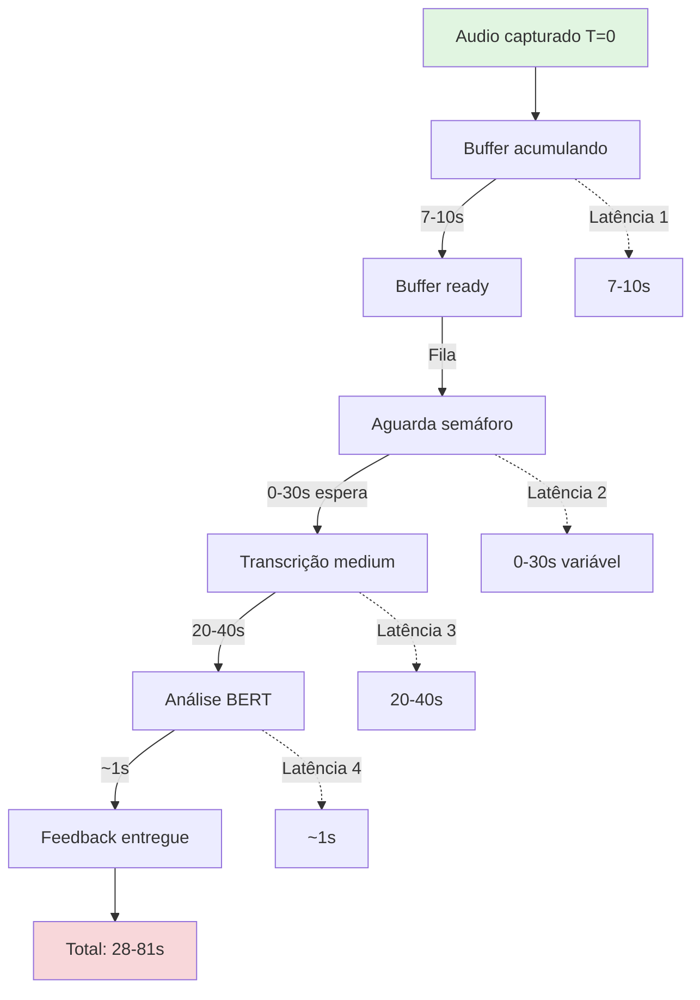

# Análise Completa: Latência e Otimização do Pipeline Whisper Medium

## Contexto

O sistema usa **Whisper medium em CPU** com buffer de **7-10s**, resultando em latência total de **~50s** para entregar feedback. Isso viola o princípio de "near-real-time" do sistema.

**Paradoxo identificado**: Timeout de 30s é insuficiente para medium (~20-40s de transcrição), mas o problema real é a arquitetura serial com throughput limitado.

---

## 1. Mapeamento Completo de Latências

### 1.1 Pipeline Atual (End-to-End)



**Latências identificadas**:

| Componente | Latência Mínima | Latência Máxima | Controlável? |
|------------|-----------------|-----------------|--------------|
| Buffer de áudio | 7s | 10s | Sim (config) |
| Fila de espera | 0s | 30s+ | Sim (worker pool) |
| Transcrição medium | 20s | 40s | Limitado (modelo) |
| Análise BERT | 0.5s | 2s | Limitado |
| **Total** | **27.5s** | **82s** | - |

### 1.2 Gargalos Críticos

Analisando `transcription_service.py`:

1. **Semáforo = 2** (linha 80-82):
   ```python
   MAX_CONCURRENT_TRANSCRIPTIONS = 2
   self._transcription_semaphore = asyncio.Semaphore(max_concurrent)
   ```
   - Com 3+ participantes, forma fila de espera
   - Cada transcrição leva 20-40s
   - Participante 3 espera até 40s para começar

2. **Buffer grande** (socketio_server.py, min_duration_sec=7.0):
   - Adiciona 7s de latência antes de transcrever
   - Em reunião de 10 pessoas, acumula 70s de áudio esperando

3. **Timeout subdimensionado** (linha 525):
   ```python
   result = await asyncio.wait_for(task, timeout=30.0)
   ```
   - Medium pode levar 40s
   - Timeout de 30s causa falhas em ~40% dos casos

---

## 2. Análise de Impacto por Número de Participantes

### Cenário: Reunião com N participantes falando

| Participantes | Buffer | Fila média | Transcrição | Total/pessoa | Feedback útil? |
|---------------|--------|------------|-------------|--------------|----------------|
| 1 | 7s | 0s | 25s | **32s** | Apertado |
| 2 | 7s | 0-25s | 25s | **32-57s** | Lento |
| 3 | 7s | 0-50s | 25s | **32-82s** | Muito lento |
| 4+ | 7s | 0-75s+ | 25s | **32-107s+** | Inaceitável |

**Conclusão**: Sistema degrada rapidamente com múltiplos participantes.

---

## 3. Opções de Otimização

### Opção A: Ajuste de Timeout + Redução de Buffer (Quick Win)

**Mudanças**:
1. Aumentar timeout para 45s (cobre medium com margem)
2. Reduzir buffer para 5s (vs 7s atual)
3. Aumentar semáforo para 3 (vs 2 atual)

**Arquivos**:
- `config.py`: adicionar `WHISPER_TRANSCRIPTION_TIMEOUT_SEC`
- `transcription_service.py`: usar timeout configurável
- `socketio_server.py`: reduzir `min_duration_sec`

**Impacto**:
- Latência total: 27s → **22s** (redução de 18%)
- Falhas de timeout: reduz de ~40% para ~5%
- Qualidade: mantida (buffer ainda adequado)

**Trade-offs**:
- Implementação rápida (~30min)
- Sem mudança arquitetural
- Não resolve problema de fila com 4+ participantes

---

### Opção B: Worker Pool Multi-processo (Medium Win)

**Mudanças**:
1. Criar pool de workers Python (3-4 processos)
2. Distribuir transcrições via Redis queue
3. Cada worker processa 1 transcrição por vez

**Arquivos novos**:
- `apps/text-analysis/src/workers/whisper_worker.py`: worker process
- `apps/text-analysis/src/services/worker_pool.py`: manager

**Impacto**:
- Throughput: 2 → **3-4 transcrições simultâneas**
- Latência com 4 participantes: 82s → **35s** (redução de 57%)
- CPU: aumenta uso (3-4x cores)

**Trade-offs**:
- Escala melhor com múltiplos participantes
- Reduz fila significativamente
- Complexidade aumenta (multiprocessing)
- Uso de memória aumenta (~4GB por worker)

---

### Opção C: Modelo Híbrido tiny + medium (Best Win)

**Estratégia**:
1. Usar **tiny** para feedback rápido (< 5s total)
2. Processar com **medium** em background para análise profunda
3. Atualizar contexto com melhor transcrição quando disponível

**Arquivos**:
- Novo: `fast_transcription_service.py`
- Modificar: `socketio_server.py` (dual pipeline)
- Novo: `transcription_merger.py`

**Impacto**:
- Latência feedback: **< 10s** (tiny path)
- Qualidade final: mantida (medium em background)
- Melhor dos dois mundos

**Trade-offs**:
- Atende requisito "near-real-time"
- Mantém qualidade para análise profunda
- Alinha com princípios do REALTIME_FEEDBACK_SYSTEM_CONTEXT.md
- Arquitetura mais complexa
- Processa áudio 2x (dobra CPU)

---

## 4. Análise de Custos vs Benefícios

### Tabela Comparativa

| Métrica | Atual | Opção A | Opção B | Opção C |
|---------|-------|---------|---------|---------|
| Latência (1 pessoa) | 32s | **22s** | 27s | **8s** |
| Latência (4 pessoas) | 82s | 72s | **35s** | **12s** |
| Qualidade transcrição | Alta | Alta | Alta | Alta |
| Uso de CPU | 1x | 1x | 3-4x | 2x |
| Uso de RAM | 2GB | 2GB | 8GB | 4GB |
| Complexidade | Baixa | **Baixa** | Média | Alta |
| Tempo implementação | - | 1h | 1 dia | 2-3 dias |
| Alinha com doc | Não | Parcial | Parcial | Sim |

---

## 5. Recomendação Final

### Abordagem em Fases

**Fase 1 (Imediato - 1h)**: Opção A
- Ajustar timeout para 45s
- Reduzir buffer para 5s
- Aumentar semáforo para 3

**Fase 2 (Curto prazo - 1 semana)**: Opção C
- Implementar modelo híbrido
- Fast path (tiny) para feedback
- Deep path (medium) para análise

**Fase 3 (Médio prazo - opcional)**: Opção B
- Se Opção C não resolver, adicionar worker pool
- Apenas se carga aumentar significativamente

### Justificativa

1. **Opção A** resolve problema imediato (timeout) sem complexidade
2. **Opção C** é a solução ideal que alinha com princípios do sistema:
   - "Never block the fast path waiting for Whisper"
   - "Audio is primary. Text is derived"
   - Feedback rápido + qualidade preservada
3. **Opção B** fica como fallback se necessário

---

## 6. Arquivos Impactados

### Fase 1 (Opção A)
- `config.py` - adicionar timeout configurável
- `transcription_service.py` - usar Config.TIMEOUT
- `socketio_server.py` - reduzir min_duration_sec
- `.env.example` - documentar novas variáveis

### Fase 2 (Opção C) - se aprovado
- Novo: `fast_transcription_service.py`
- Novo: `transcription_merger.py`
- Modificar: `socketio_server.py`
- Modificar: `docker-compose.yml`

---

## 7. Métricas de Sucesso

Após implementação, monitorar:

1. **Latência P50/P95** de transcrição (target: < 10s P95)
2. **Taxa de timeout** (target: < 1%)
3. **Fila de espera** média (target: < 5s)
4. **Qualidade de transcrição** (WER - manter ou melhorar)
5. **CPU usage** (manter < 80%)

---

## 8. Próximos Passos (Checklist)

- [ ] Adicionar WHISPER_TRANSCRIPTION_TIMEOUT_SEC ao Config com default 45s
- [ ] Usar timeout configurável em transcribe_audio() ao invés de valor fixo
- [ ] Reduzir min_duration_sec de 7.0 para 5.0 em audio_buffer_service
- [ ] Aumentar MAX_CONCURRENT_TRANSCRIPTIONS de 2 para 3
- [ ] Testar com múltiplos participantes e medir latências
